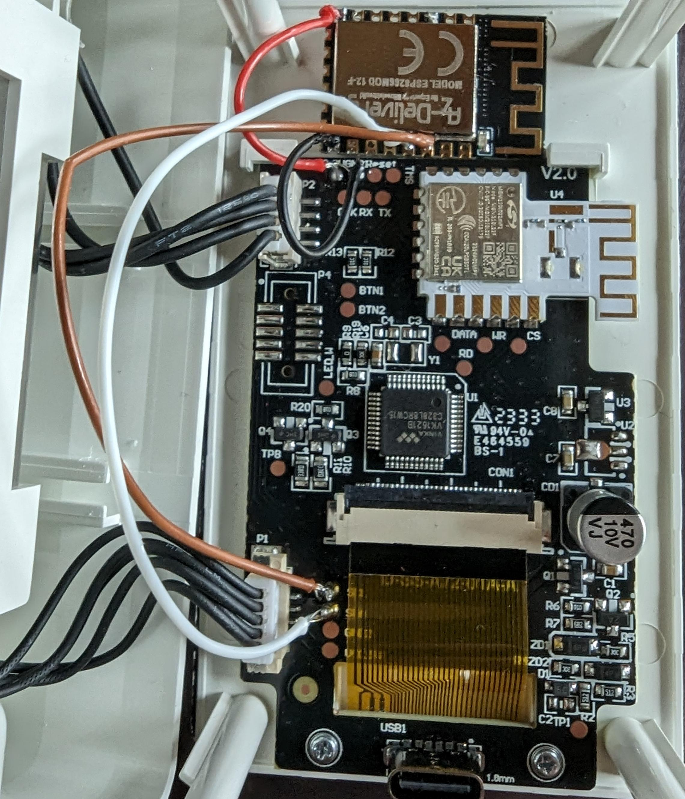

# ESP8266 IKEA Vindstyrka/ Sensirion SEN54 Vera Integration

This project is a simple ESP8266 program designed to read environmental data from a Sensirion SEN54 sensor and publish it to [Vera](https://getvera.com/).




## Based on
 - https://github.com/techniker/sen54_mqtt
 - https://github.com/Sensirion/arduino-i2c-sen5x/blob/master/examples/exampleUsage/exampleUsage.ino

## Features

- Reads data from Sensirion SEN54 sensor.
- Publishes data to Vera HTTP endpoints via LUUP Requests.
- Configurable reading interval with offset to avoid conflicts in multi-sensor setups.

## Prerequisites

- ESP8266 module such as ESP8266 12F
- Sensirion SEN54 sensor (IKEA Vindstyrka)
- WiFi network
- [Sensirion I2C SEN5X Arduino Library](https://github.com/Sensirion/arduino-i2c-sen5x) 
 

## Hardware Setup

1. Connect the Sensirion SEN54 (use test-pads on Vindstyrka PCB under display flat-flex ribbon cable) sensor to the ESP8266 via the I2C interface PINs:

* SCL -> D1/20/GPIO5=SCL
* SDA -> D2/19/GPIO4

## Software Setup

### Configuration

#### Create Vera Devices :

**Temperature sensor**

```curl "http://VERAIP:3480/data_request?id=action&serviceId=urn:micasaverde-com:serviceId:HomeAutomationGateway1&action=CreateDevice&deviceType=urn:schemas-micasaverde-com:device:TemperatureSensor:1&internalID=&Description=VindstyrkaTemperature&UpnpDevFilename=D_TemperatureSensor1.xml&UpnpImplFilename=&MacAddress=&RoomNum=0&Reload=1&IpAddress="```

**Humidity sensor**

```curl "http://VERAIP:3480/data_request?id=action&serviceId=urn:micasaverde-com:serviceId:HomeAutomationGateway1&action=CreateDevice&deviceType=urn:schemas-micasaverde-com:device:HumiditySensor:1&internalID=&Description=VindstyrkaHumidity&UpnpDevFilename=D_HumiditySensor1.xml&UpnpImplFilename=&MacAddress=&RoomNum=0&Reload=1&IpAddress="```

**VOC sensor**:
```curl "http://VERAIP:3480/data_request?id=action&serviceId=urn:micasaverde-com:serviceId:HomeAutomationGateway1&action=CreateDevice&deviceType=urn:schemas-micasaverde-com:device:GenericSensor:1&internalID=&Description=VindstyrkaVOC&UpnpDevFilename=D_GenericSensor1.xml&UpnpImplFilename=&MacAddress=&RoomNum=0&Reload=1&IpAddress="```

Before compiling and uploading the code to your ESP8266, you need to configure the following:

- **WiFi Settings:** Enter your WiFi SSID and password in the provided variables in config.h
- **Vera device IDs:** Enter Device Ids returned by Vera during device creation in the provided variables in config.h
- **Vera IP address :** Enter Vera IP address in the provided variables in config.h
- **OTA Server IP address :** Enter [OTA server](https://github.com/garyttirn/8266OTA) IP address in the provided variables in config.h

### Dependencies

This project requires the following Arduino libraries:

- `ESP8266WiFi`
- `Wire`
- `SensirionI2CSen5x`

### Compilation and Upload

Using the Arduino IDE, compile the sketch and upload it to your ESP8266 device.

## Usage

Once powered, the ESP8266 connects to the configured WiFi network and begins reading data from the SEN54 sensor at specified _readInterval_. The sensor data is published to Vera according to the set _reportingInterval_.

## 

The program updates the following Vera variables :
| Vera Device ID | Variable | Visible in Vera UI Dashboard Device |
| ------------- | ------------- |------------- |
| VeraTempDeviceID  | CurrentTemperature | Yes |
| VeraTempDeviceID | CurrentRSSI | No |
| VeraTempDeviceID  | Vcc | No |
| VeraHumDeviceID  | CurrentLevel| Yes |
| VeraVOCDeviceID  | CurrentLevel | Yes |
| VeraVOCDeviceID  | Pm1p0| No |
| VeraVOCDeviceID  | Pm2p5 | No |
| VeraVOCDeviceID  | Pm4p0| No |
| VeraVOCDeviceID  | Pm10p0 | No |